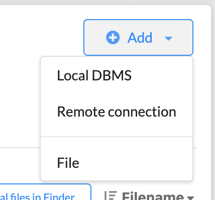
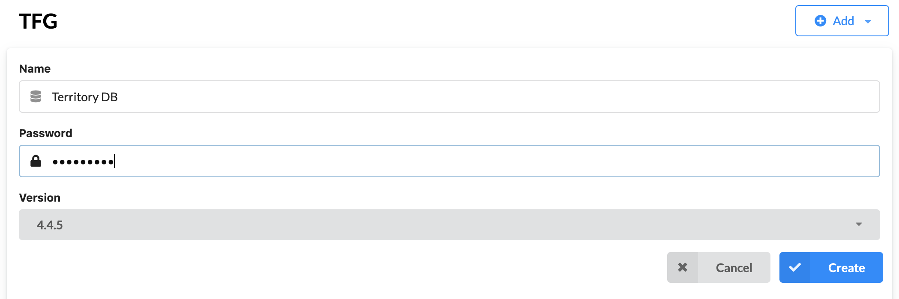
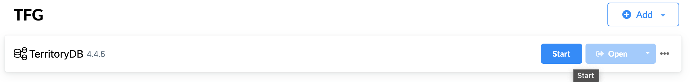
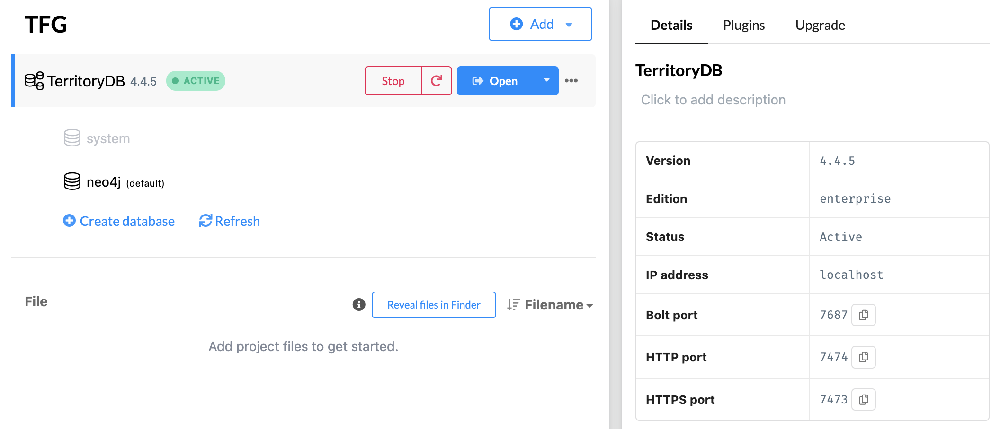
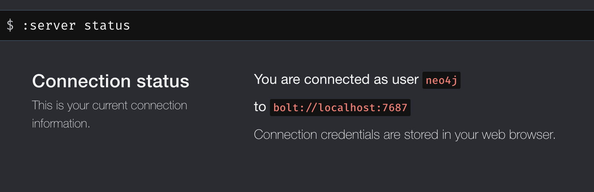
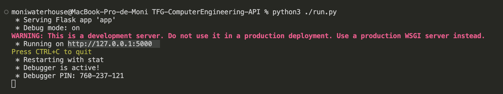
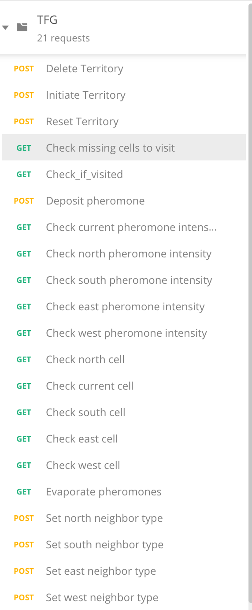

# Directional Pheromone Walk - Server

This repository contains a REST API to interact with a territory that was modeled in Neo4j.

## Pre-requirements
- [Python 3](https://www.python.org/downloads/)
- [Flask](https://pypi.org/project/Flask/)
- [Neo4j Desktop](https://neo4j.com/download/)

## Starting the Database

1. Open Neo4j Desktop and create a new project.
   
2. Add a new data base to your project.
    
3. Choose the name you want to give to the data base, and for the password use: *territory*. Click the **Create** button.
   
4. Once it is created, click the **Start** button.
   
5. When the data base starts, you will be able to see its info at the right side of the window. 
   
6. To check that is it running properly, click on open. Check that the info from the data base matches the variables in `app/config.py`
   

Note: you can skip the previous steps if you already have the data base created. Just make sure to always start it before running the API.

## Run the server

In the root of this project, open a terminal and run the following command:

```shell
python3 ./run.py
```

The server should start running on `http://127.0.0.1:5000`



## Testing the requests

Import the `DPW_Collection.json` in Postman. This collection contains all 21 requests to interact with the territory from the database.

